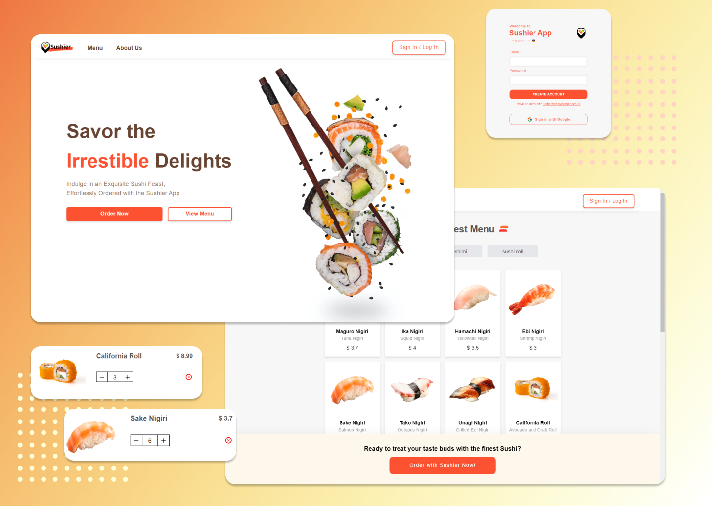

# Sushier - Sushi E-Commerce Web App by Ziqi Fang

Welcome to Sushier,where we make sushi ordering effortlessly easy! Sushier is a **concept sushi e-commerce web application** that combines the art of sushi with cutting-edge technology. Explore Sushier App today! 🍣

## Table of Contents

- [Introduction](#introduction-star)
- [Features](#features-mega)
- [Usage Guide](#usage-guide-sake)
- [Design Idea & Process](#design-idea--process-art)
- [Tech Stack](#tech-stack-computer)
- [App Versions](#app-versions-page_with_curl)
- [Getting Started](#getting-started-stars)
- [Contact](#contact-mailbox_closed)

## Introduction :star:

Sushier is a concept project created by [Ziqi Fang](https://linkedin.com/in/ziqi-fang), a junior software engineer who likes experimenting new ideas and bringing concept projects to life. All rights reserved.

## Features :mega:

- **Extensive Sushi Menu**: Explore our expansive menu featuring a wide variety of sushi dishes, from Nigiri to Sashimi.

- **User-Friendly Ordering**: Our intuitive and responsive interface allows you to easily customize your order, add items to your cart, and complete transactions hassle-free.

## Usage Guide :sake:

Visit [Sushier](https://www.sushier.app/) to explore our sushi e-commerce platform. Follow these steps to get started:

1. **Browse the Menu**: Discover a variety of sushi options and select your favorite dishes.

2. **Customize Your Order**: Customize your order with special requests, if desired.

3. **Add to Cart**: Add selected items to your cart.

4. **Checkout**: Proceed to checkout, review your order, and make a secure payment.

## Design Idea & Process :art:

Sushier's UX/UI design follows modern user experience principles and uses the newest design tools to offer a seamless digital experience.

### Design Inspiration 🌟

In the initial stage, we drew inspiration from the combination of Sushi and E-commerce online ordering. We scoured design reference websites like [Dribbble](https://dribbble.com/) for visual inspirations that informed our design choices.

### Wireframing and Prototyping ✏️

To bring our vision to life, we utilized professional design tools such as [Figma](https://www.figma.com/). This allowed us to create detailed wireframes and interactive prototypes that helped us plan the user interface and functionality with precision.

### Responsive Design 📱

Sushier's design is fully responsive, ensuring a seamless experience across a variety of devices. We employed technologies like [Tailwind CSS](https://tailwindcss.com/) to craft customized, case-by-case screen breakpoints in CSS. This attention to detail guarantees a flawless transition between different screen sizes.

**For an in-depth look at our design process, including design artifacts and detailed documentation, please visit our [Design Process Repository](link-to-design-process-repo).**

## Tech Stack :computer:

Sushier is powered by a robust tech stack:

- **Frontend**: Developed with [React](https://reactjs.org/) and [Next.js](https://nextjs.org/) for a fast and interactive user experience.

- **Authentication**: We use [NextAuth](https://next-auth.js.org/) for secure user authentication, with credential and Google providers.

- **Database**: [MongoDB Atlas](https://www.mongodb.com/cloud/atlas) stores user credentials, providing a personalized experience.

- **Headless CMS**: Sushier utilizes [Amazon S3](https://aws.amazon.com/s3/) as our headless CMS to store and manage dishes images and other media assets.

- **Deployment**: The app is deployed on [Vercel](https://vercel.com/), ensuring high performance and reliability.

## App Versions :page_with_curl:

- **Current Version**: 1.0.0

- **Future Features**: We are actively working on enhancing the Sushier experience with a range of exciting new features:

  - **Integration with Stripe Payment**: In the upcoming release, we're completing our integration with Stripe to bring secure, in-app payment options to Sushier. You'll be able to order your favorite sushi dishes and pay seamlessly within the app.

  - **New Category: "Special Dishes"**: Get ready for a delightful addition to our menu! We're introducing a "Special Dishes" category, featuring limited-time festival delicacies and discounted regular dishes. Keep an eye out for countdown timers to make sure you don't miss these delectable treats.

  - **Email Marketing Integration**: Stay connected with Sushier! We're integrating with email marketing services like Mailchimp and AWS SES to send you exclusive promotions, updates, and mouthwatering sushi offers. Subscribe to Sushier to receive these delectable updates in your inbox.

  - **Loyalty Rewards Program (Previously Mentioned)**: Sushier's loyalty program is in the pipeline. Earn points with every order and redeem them for discounts and free sushi dishes.

Stay tuned for these exciting updates!

## Getting Started :stars:

To explore Sushier, Please follow this [production link](https://www.sushier.app/).

## Contact :mailbox_closed:

Have questions or feedback? Reach out to [Ziqi's Email](mailto:zfang1207@gmail.com) or connect on [LinkedIn](https://linkedin.com/in/ziqi-fang).

Thank you for visiting Sushier, where innovation and sushi converge. Explore the flavors, order with ease, and join us on this culinary adventure!

[Visit Sushier](https://www.sushier.app/)
