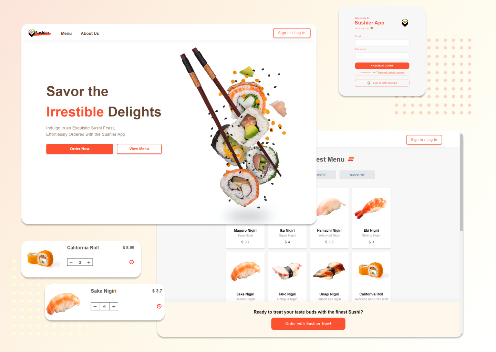

# Sushier - Sushi E-Commerce Web App by Ziqi Fang

Welcome to Sushier, where sushi meets innovation! Sushier is a **concept sushi e-commerce web application** that combines the art of sushi with cutting-edge technology. Explore Sushier App today! 🍣

## Table of Contents

- [Introduction](#introduction)
- [Features](#features)
- [Usage Guide](#usage-guide)
- [Design Process](#design-process)
- [Tech Stack](#tech-stack)
- [Getting Started](#getting-started)
- [Contributing](#contributing)
- [License](#license)
- [Contact](#contact)

## Introduction

Sushier is a concept project created by [Your Name](link-to-your-LinkedIn-profile), a visionary entrepreneur passionate about merging culinary innovation with cutting-edge technology. All rights reserved.

## Features

- **Extensive Sushi Menu**: Explore our expansive menu featuring a wide variety of sushi dishes, from traditional classics to innovative creations.

- **User-Friendly Ordering**: Our intuitive and responsive interface allows you to easily customize your order, add items to your cart, and complete transactions hassle-free.

- **Real-Time Order Tracking**: Stay informed with real-time order tracking, ensuring you know exactly when your sushi will be ready for pickup or delivered to your doorstep.

- **Secure Payments**: We've integrated Stripe, a trusted payment gateway, for secure and convenient online payments.

- **Exceptional Customer Support**: Our dedicated support team is ready to assist you with any inquiries or concerns, ensuring a top-notch experience.

## Usage Guide

Visit [Sushier](link-to-live-app) to explore our sushi e-commerce platform. Follow these steps to get started:

1. **Browse the Menu**: Discover a variety of sushi options and select your favorite dishes.

2. **Customize Your Order**: Customize your order with special requests, if desired.

3. **Add to Cart**: Add selected items to your cart.

4. **Checkout**: Proceed to checkout, review your order, and make a secure payment.

5. **Track Your Order**: Use our real-time order tracking to monitor the progress of your order.

6. **Enjoy Your Sushi**: Once your order is ready, savor the flavors of our delectable sushi.

## Design Process

Sushier's design process involved a meticulous blend of culinary artistry and modern user experience principles. Our goal was to create a platform that celebrates sushi traditions while offering a seamless digital experience.

- **Wireframing and Prototyping**: We began with wireframes and prototypes to plan the user interface and functionality.

- **Responsive Design**: Our design is fully responsive, ensuring a smooth experience on both desktop and mobile devices.

- **User-Centric Approach**: We prioritized user feedback to enhance usability and accessibility.

- **Branding**: The Sushier brand aims to evoke the essence of sushi, combining elegance with innovation.

## Tech Stack

Sushier is powered by a robust tech stack:

- **Frontend**: Developed with [React](https://reactjs.org/) and [Next.js](https://nextjs.org/) for a fast and interactive user experience.

- **Authentication**: [Firebase Authentication](https://firebase.google.com/products/auth) ensures secure user authentication.

- **Database**: [MongoDB Atlas](https://www.mongodb.com/cloud/atlas) stores order history, providing a personalized experience.

- **Payment Integration**: We've seamlessly integrated [Stripe](https://stripe.com/) for secure and convenient payments.

- **Deployment**: The app is deployed on [Vercel](https://vercel.com/), ensuring high performance and reliability.

## Getting Started

To explore Sushier or contribute to the project, follow these steps:

1. Clone the repository: `git clone https://github.com/your-username/sushier.git`

2. Install dependencies: `npm install`

3. Run the app: `npm start`

For detailed instructions on setting up the development environment, see [CONTRIBUTING.md](link-to-contributing-documentation).

## Contributing

We welcome contributions from the open-source community! If you'd like to contribute to Sushier, please read our [CONTRIBUTING.md](link-to-contributing-documentation) for guidelines and steps to get started.

## License

Sushier is licensed under the [MIT License](link-to-license). Feel free to use, modify, and distribute the code.

## Contact

Have questions or feedback? Reach out to [Your Email Address](mailto:your-email@example.com) or connect on [LinkedIn](link-to-your-LinkedIn-profile).

Thank you for visiting Sushier, where innovation and sushi converge. Explore the flavors, order with ease, and join us on this culinary adventure!

[Visit Sushier](link-to-live-app)
